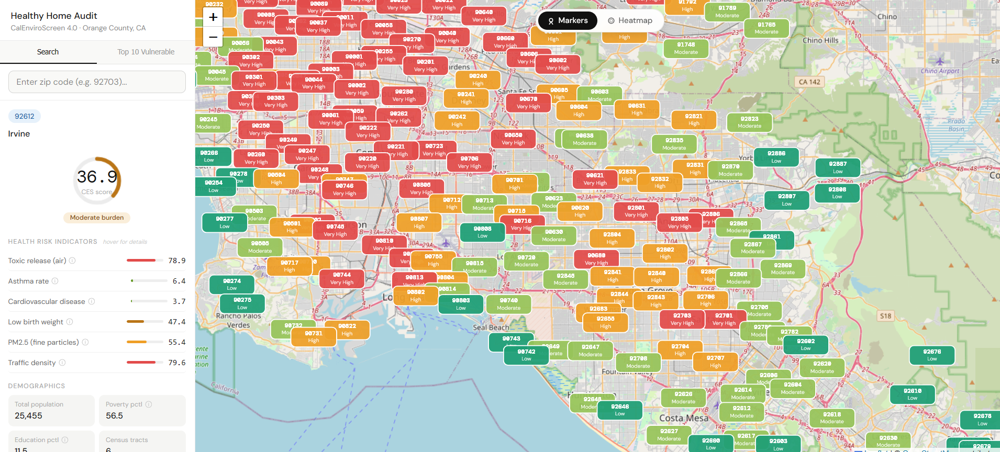
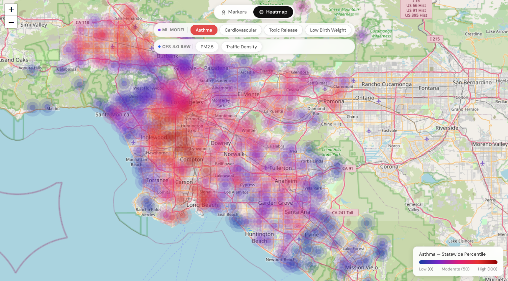

# Healthy Home Audit


🌐 Live Demo: https://environmental-health-risk-map.vercel.app  
📊 API: [https://your-render-api-link.onrender.com  ](https://environmental-health-risk-map.onrender.com/docs)

An interactive geospatial dashboard for visualizing environmental health risk across Southern California ZIP codes, powered by machine learning and CalEnviroScreen 4.0 data.




## Features

- Color-coded ZIP code markers by CES 4.0 burden level (green → red)
- Sidebar with health risk indicators, demographics, ethnicity breakdown, and tips for reducing exposure
- ZIP code search
- Real-time health risk predictions (asthma & cardiovascular) via FastAPI
- Support for unseen ZIP codes using geospatial nearest-neighbor estimation
- Health Vulnerability Index (HVI) combining pollution, health outcomes, and socioeconomic factors
- Heatmap visualization for continuous regional risk mapping
- Top 10 most vulnerable ZIP codes ranking

## Getting Started

### Prerequisites

- Node.js 18+
- Python 3.10+
- npm or yarn

### Frontend
```bash
npm install
npm run dev
```

Open [http://localhost:5173](http://localhost:5173) in your browser.

### Backend
```bash
cd backend
pip install -r requirements.txt
uvicorn main:app --reload
```

API will be available at [http://127.0.0.1:8000](http://127.0.0.1:8000).

### Production Build
```bash
npm run build
npm run preview
```

## Project Structure
Datathon2026/  
├── backend/  
│   ├── Asthma/  
│   │   ├── air_quality.py  
│   │   ├── asthma_model.py  
│   │   ├── asthma_model.ipynb  
│   │   ├── asthma_statistics.py  
│   │   ├── shap_importance_plot.py  
│   │   └── zip_calculations.py  
│   ├── Cardiovascular/  
│   │   └── cardiovascular_model.py  
│   ├── Toxicity/  
│   │   └── LBW&Toxicity.ipynb  
│   ├── health_index/  
│   │   ├── health_index_score.py  
│   │   └── text_health.py  
│   ├── generate_predicted_zips.py  
│   └── main.py  
├── data/  
│   ├── cardiovascular.csv  
│   ├── data.csv  
│   ├── Melissa_zipcodes.csv  
│   ├── shap_importance.csv  
│   └── top_10_percentile_zips.csv  
├── frontend/  
│   └── src/  
│       ├── components/  
│       ├── data/  
│       ├── utils/  
│       ├── App.jsx  
│       ├── App.css  
│       ├── main.jsx  
│       └── index.css  
└── models/  
├── best_xgb_model.pkl  
├── cardiovascular_model.pkl  
└── NeuralNetwork.pkl  

## How It Works

### Machine Learning

- **XGBoost (Asthma)** – Predicts asthma-related health risk using environmental exposure features (PM2.5, ozone, traffic, etc.)
- **XGBoost (Cardiovascular)** – Estimates cardiovascular disease risk using similar features
- **Neural Network** – Additional model for toxic release risk estimation, trained alongside the XGBoost models
- Models trained with data cleaning, preprocessing, cross-validation, and hyperparameter tuning

### Health Vulnerability Index (HVI)

A composite score combining:

- Pollution burden (air quality, toxic releases)
- Health outcomes (asthma, cardiovascular risk)
- Socioeconomic factors (poverty, education, unemployment, housing burden)

Features are normalized and weighted to produce a unified vulnerability score.

### Unknown ZIP Code Handling

1. Geocode unknown ZIP using Melissa dataset
2. Find nearest known ZIP via haversine distance
3. Use nearest ZIP's features as proxy input
4. Run ML inference to estimate risk

## Data Sources

- [CalEnviroScreen 4.0](https://oehha.ca.gov/calenviroscreen)
- [EPA ECHO](https://echo.epa.gov/)
- [PurpleAir API](https://www2.purpleair.com/)
- [OpenStreetMap](https://www.openstreetmap.org/)
- [Melissa ZIP Code Geocoding Database](https://www.melissa.com/)

## Inspiration

Environmental health risk is not evenly distributed. Many high-risk communities remain invisible in raw datasets. Healthy Home Audit was built to make these risks accessible, understandable, and actionable for everyone.

## Social & Environmental Impact

- Provides visibility into environmental health risks for vulnerable communities
- Highlights ZIP codes with high pollution and health vulnerability to guide policy and public awareness
- Supports data-driven decisions for local governments, NGOs, and community organizations
- Empowers residents and policymakers with actionable insights and suggestions for improving health outcomes
- Helps identify environmental justice disparities across Southern California

## Example Use Cases

- A city health department identifies top 10 most vulnerable ZIP codes for asthma intervention programs
- Residents explore their local ZIP's health and pollution profile and receive actionable tips to reduce exposure
- Researchers analyze environmental disparities across Southern California
